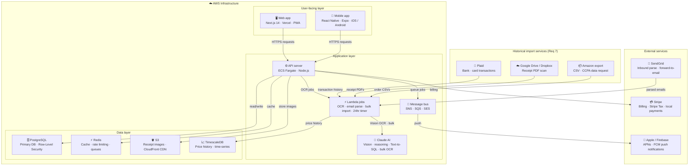
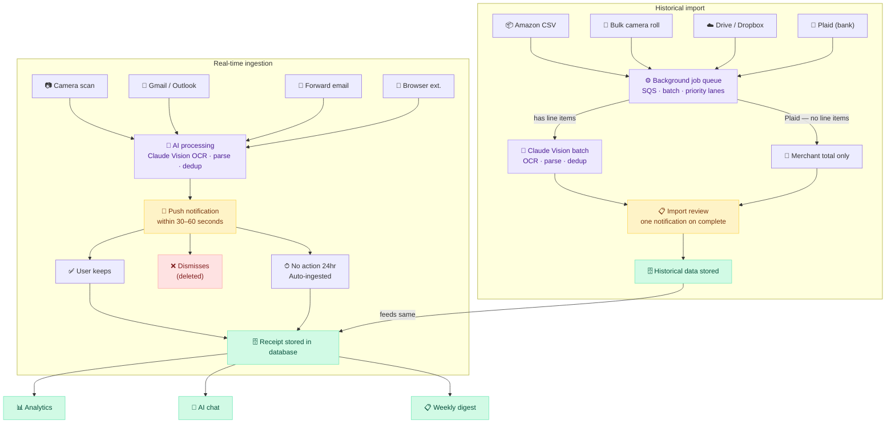

# ReceiptIQ — Implementation & AWS Deployment Plan

---

## Team

| Role | Responsibility | Phase needed |
|---|---|---|
| Full-stack engineer (web + API) | Next.js frontend, Node.js API, database | Phase 1 |
| Mobile engineer (React Native) | iOS + Android app, camera, push notifications | Phase 1 |
| AI / integrations engineer | OCR pipeline, email parsers, Claude API | Phase 1 |
| DevOps engineer (part-time) | AWS provisioning, CI/CD, monitoring | Phase 1 |
| Product / design | UI decisions, user research, copy | Phase 1 |

A lean founding team of 2–3 strong full-stack engineers can cover these roles to get Phase 1 into production. Mobile and DevOps are where gaps show up first.

---

## Timeline

| Phase | What ships | Estimated duration |
|---|---|---|
| Phase 1 — Core | Auth, OCR scan, line-item storage, dashboard | 10–14 weeks |
| Phase 2 — Intelligence + Household | Price history, crowd-sourced vendor comparison, inflation tracker, net worth tracking, Plaid bank sync (ongoing), household mode v1 | +8 weeks |
| Phase 3 — Smart Shopping | List estimator (type or upload), budget alerts, spend forecasting, custom date range reports, labelled periods, AI spending assistant (chat), Amazon CSV import, bulk camera roll scan, history onboarding flow | +8 weeks |
| Phase 4A — Email Ingestion | Gmail + Outlook OAuth, forward-to-email, top 12 retailer parsers, duplicate detection, consent screen | +6 weeks |
| Phase 4B — Bills + Notifications | Bills ingestion (dining, subscriptions, travel, parking), instant push notifications with Keep/Dismiss, 24hr auto-ingest, weekly digest, browser extension | +8 weeks |
| Phase 4C — Extended Bills | Utilities, phone, rent, car services, account number redaction engine, bill due date calendar, per-source notification preferences | +6 weeks |
| Q1 2026 — Full Life Spend | Medical bills + EOBs (sensitivity flagging), inbox history backfill, 20+ retailer parsers, retailer API BD track begins | +12 weeks |

**Total to full v1: 14–20 months** with a team of 3, assuming no major pivots.

---

## AWS Architecture

### Core services

| Service | Purpose |
|---|---|
| **ECS Fargate** | Runs Node.js API containers — auto-scales without managing servers |
| **RDS PostgreSQL** | Primary database, Multi-AZ for reliability, TimescaleDB extension for price history |
| **ElastiCache Redis** | Sessions, rate limiting, job queues |
| **S3** | Receipt image storage |
| **Lambda** | OCR processing jobs — triggered when a receipt image lands in S3, pay per scan only |
| **SES + API Gateway** | Inbound email ingestion for receipts@receiptiq.app (forward-to-email channel) |
| **SNS** | Fan-out push notifications to APNs (Apple) and FCM (Google) — fires within 30–60 seconds of ingestion for instant Keep/Dismiss approval |
| **SQS** | Background job queue for email parsing, backfill jobs, and notification scheduling |
| **CloudFront** | CDN in front of S3 for fast receipt image delivery |
| **Cognito** | OAuth (Google, Apple) — avoids building auth from scratch |
| **Route 53** | DNS for receiptiq.app and receipts.receiptiq.app subdomain |
| **Certificate Manager** | Free SSL for all domains |
| **Secrets Manager** | OAuth tokens, API keys, Claude API key — encrypted at rest |

### Frontend hosting
- **Vercel** for the Next.js web app — simpler than AWS Amplify, deploys on every merge, integrates with GitHub natively
- Points to the ECS API via environment variable

### Architecture diagram



---

### Workflow diagram



---

## CI/CD Pipeline

```
Developer pushes to GitHub
        │
        └── GitHub Actions
                ├── Run tests (Jest + Playwright)
                ├── Build Docker image
                ├── Push to ECR (Elastic Container Registry)
                ├── Deploy to ECS Fargate (rolling update)
                ├── Run DB migrations (Flyway)
                └── Expo EAS Build (mobile OTA update or store build)

Environments: dev → staging → production
Merges to main → staging auto-deploy
Merges to release → production deploy with manual approval gate
```

### Infrastructure as code
- **Terraform** or **AWS CDK** — entire AWS setup version-controlled and reproducible
- Separate stacks for networking, compute, database, and storage
- Environment variables injected from Secrets Manager at deploy time

---

## Database Tables — New Additions

All tables below are additive — no existing tables are modified destructively.

| Table | Added in | Purpose |
|---|---|---|
| `ingestion_sources` | Requirement 1 | Stores OAuth tokens and connection config per user per source |
| `ingestion_log` | Requirement 1 | Audit trail of every email parsed — confidence score, outcome, errors |
| `recurring_patterns` | Requirement 2 | Tracks recurring bills for auto-keep rules and frequency detection |
| `review_inbox` | Requirement 2 | Powers the weekly digest — tracks keep/dismiss/auto-ingest status per item |
| `device_tokens` | Requirement 3 | APNs and FCM tokens per device per user for push delivery |
| `notification_log` | Requirement 3 | Audit trail of every push sent — action taken, timing, fallback status |
| `spending_periods` | Requirement 4 | User-named date ranges (trips, events) for custom report recall |
| `saved_reports` | Requirement 4 | Cached report snapshots for fast reload and export |
| `ai_chat_sessions` | Requirement 5 | Tracks conversation sessions per user |
| `ai_chat_log` | Requirement 5 | Full audit trail of every chat turn — SQL generated, tokens, cost |
| `historical_imports` | Requirement 7 | Tracks bulk import jobs — status, progress, date range, error log |
| `net_worth_snapshots` | Requirement 8 | Daily net worth snapshots — assets, liabilities, per-account breakdown |
| `goals` | Requirement 8 | User-defined savings and spending goals with progress tracking |
| `streaks` | Requirement 8 | Budget, scan, and savings streaks — current count and all-time best |

### Additive columns on existing tables

**`receipts`** — ingestion source tracking:
```
+ ingestion_source_id (FK → ingestion_sources, nullable)
+ auto_ingested (boolean, default false)
+ ingestion_confidence (float 0–1, nullable)
+ external_order_id (retailer order ID, nullable)
+ needs_review (boolean)
```

**`receipt_items`** — bill line item support:
```
+ item_type ('product' | 'service' | 'bill_line' | 'fee' | 'tax')
+ sensitivity ('standard' | 'medical' | 'financial')
+ redacted (boolean, default false)
+ recurring_pattern_id (FK → recurring_patterns, nullable)
```

**`user_preferences`** — notification controls:
```
+ notif_mode ('instant' | 'daily' | 'weekly' | 'off', default 'instant')
+ notif_amount_threshold (float, default 20.00)
+ notif_quiet_hours_enabled (boolean, default false)
+ notif_quiet_start (time, nullable)
+ notif_quiet_end (time, nullable)
+ notif_frequency_cap (int, default 3)
+ notif_grouping_window_hours (int, default 2)
```

---

## Monthly AWS Cost Estimates

| Stage | Monthly cost | What's running |
|---|---|---|
| Dev / staging | ~$80–150 | Small RDS t3.micro, single Fargate task, minimal Lambda |
| Early production (0–1k users) | ~$300–500 | RDS t3.medium, Fargate autoscaling, S3, CloudFront |
| Growth (1k–10k users) | ~$800–1,500 | RDS scaling up, more Lambda invocations, Redis cluster |
| Scale (10k+ users) | ~$2,500–5,000 | Multi-AZ RDS, larger Fargate cluster, heavy Lambda usage |

### Additional costs (not AWS)
| Service | Cost |
|---|---|
| Claude API (OCR + intelligence) | ~$0.003 per receipt scan — 10k scans/mo ≈ $30 |
| Vercel (web hosting) | Free tier covers early stage, Pro $20/mo |
| Expo EAS Build (mobile) | Free tier for low volume, $29/mo at scale |
| SendGrid (inbound email parsing) | Free up to 100 inbound/day, $19.95/mo beyond |
| Sentry (error monitoring) | Free tier, $26/mo for teams |
| Datadog (APM) | ~$15/host/mo |

---

## Hardest Parts — Where to Budget Extra Time

### 1. Email parser maintenance
Retailer email templates change 2–4× per year. Each parser needs a version hash and a monitoring system that alerts when confidence scores drop. Plan for ongoing maintenance — this never stops.

### 2. Claude Vision OCR accuracy
Works well for clean receipts, struggles with crumpled paper, bad lighting, or handwritten checks. A user-facing "correct this item" flow is required from Phase 1, not a nice-to-have.

### 3. Vendor price comparison
No clean API for live retail prices exists. The plan relies on Google Shopping data, selective web scraping (with legal caution), and Claude's knowledge. This is the fuzziest part of the technical spec and the most likely to need an architectural pivot.

### 4. Mobile camera UX
Getting receipt scanning to feel fast and reliable on a phone requires real polish — lighting detection, auto-crop, angle correction. Allocate 2–3 extra weeks here versus the estimate.

### 5. TimescaleDB at scale
Straightforward to start. Query optimization on price history across millions of items and users needs attention from ~50k users onward.

### 6. iOS push notification background actions
The inline Keep / Dismiss buttons in push notifications require a background fetch entitlement on iOS and careful handling of the UNNotificationResponse API. Allow extra time for App Store review with this entitlement.

### 7. 24-hour auto-ingest timer reliability
The Lambda function that fires after 24 hours of notification inaction must be reliable — a missed trigger means a receipt silently never gets ingested. Use SQS with a visibility timeout + dead-letter queue to guarantee delivery. Test failure scenarios explicitly.

---

## De-risking — What to Validate First

Before building any UI, validate these in order:

1. **OCR pipeline** — run Claude Vision against 50 real-world receipt photos (crumpled, dark, angled). If accuracy is below 90%, the product concept needs to adjust before any other work starts
2. **Email parser on real inboxes** — test against actual Amazon and Walmart emails, not samples. Retailer emails vary by account type, region, and order type
3. **One real user scanning real receipts** — within the first 4 weeks of Phase 1, not a demo
4. **Vendor price comparison feasibility** — spike this in week 2; don't assume it works at acceptable cost and accuracy
5. **Push notification inline actions** — test on a real iOS device early; the simulator behaviour differs from production
6. **24-hour auto-ingest reliability** — simulate missed Lambda triggers and confirm the dead-letter queue catches them before shipping to production

---

## Phase 1 — Infrastructure Cost Breakdown

> Phase 1 scope: auth, AI receipt scanning, line-item storage, spending dashboard, mobile app skeleton, core REST API. No email ingestion, no bills, no push notifications — those are Phase 4.

---

### AWS Services — Monthly (Phase 1 only)

| Service | Configuration | Monthly cost |
|---|---|---|
| ECS Fargate | Node.js API — 0.25 vCPU, 0.5GB RAM | ~$15 |
| RDS PostgreSQL | db.t3.micro, single-AZ | ~$13 |
| S3 | Receipt image storage (~5GB at launch) | ~$1 |
| Lambda | OCR processing jobs — triggered per scan | ~$1 |
| Cognito | OAuth (Google, Apple) — first 50k MAU free | $0 |
| Route 53 | DNS for receiptiq.app | ~$1 |
| Secrets Manager | OAuth tokens, API keys (~5 secrets) | ~$2 |
| CloudFront | CDN for receipt images | ~$1 |
| Certificate Manager | SSL | $0 |
| **AWS subtotal** | | **~$34/mo** |

---

### Third-Party Services — Monthly

| Service | Purpose | Cost |
|---|---|---|
| Claude API | OCR per receipt scan | Variable — see below |
| Vercel | Next.js web frontend | $0 (free tier) |
| Expo | React Native mobile builds + OTA | $0 (free tier) |
| Sentry | Error monitoring | $0 (free tier) |
| GitHub | Code hosting + Actions CI/CD | $0 (free tier) |
| Apple Developer | App Store distribution | $99/year = ~$8/mo |
| Google Play | Android distribution | $25 one-time |

---

### Claude API — The Key Variable

Phase 1 is almost entirely OCR. Every receipt scan calls Claude Vision to extract line items.

**Cost per scan:**
- Input: ~2,500 tokens (image + prompt) × $3/MTok = ~$0.0075
- Output: ~500 tokens (extracted JSON) × $15/MTok = ~$0.0075
- **Total per scan: ~$0.015–0.02**

| Monthly scans | Claude API cost |
|---|---|
| 500 | ~$8 |
| 2,000 | ~$32 |
| 5,000 | ~$80 |
| 10,000 | ~$160 |

The OCR cost is the only line item that scales directly with usage. Everything else stays flat until user volume forces infrastructure upgrades.

---

### Total Monthly Cost by Stage

| Stage | Users | Receipts/mo | AWS | Claude API | Other | **Total** |
|---|---|---|---|---|---|---|
| Pre-launch / dev | 0–10 | < 200 | ~$34 | ~$3 | $8 | **~$45** |
| Early users | 10–100 | ~500 | ~$34 | ~$8 | $8 | **~$50** |
| Getting traction | 100–500 | ~2,000 | ~$80 | ~$32 | $28 | **~$140** |
| Phase 1 peak | 500–1,000 | ~5,000 | ~$150 | ~$80 | $55 | **~$285** |

The jump from $50 to $140 is driven by RDS scaling to t3.small, ElastiCache Redis being added, and Vercel Pro kicking in. Phase 1 stays well under $300/month even at 1,000 users.

---

### One-Time Setup Costs

| Item | Cost |
|---|---|
| Domain registration (receiptiq.app) | ~$12/year |
| Apple Developer account | $99/year |
| Google Play Console | $25 one-time |
| AWS account setup + Terraform | $0 |
| **Total one-time** | **~$136** |

---

### Build Cost — The Bigger Number

Infrastructure is cheap. Engineering time is where Phase 1 actually costs money.

**If founders are building it:**
- Main costs are AWS (~$50/mo) and Claude API
- 10–14 weeks of founder engineering time

**If hiring contractors:**

| Team | Timeline | Cost |
|---|---|---|
| 2 engineers (web + mobile split) | 12 weeks | ~$78k |
| 1 strong full-stack engineer | 16 weeks | ~$39k |
| 3 engineers (recommended) | 10 weeks | ~$117k |

---

### The One Cost to Watch Closely

Claude API scales with every scan. A viral moment with 50,000 scans in a month = ~$800 in unplanned API costs. Two mitigations to build from day one:

1. **Per-user monthly scan limit** — e.g. 100 scans free, then paid tier. Protects against abuse and creates a natural monetisation lever.
2. **Response caching** — if the same receipt image is uploaded twice (matched by file hash), return the cached extraction instead of calling Claude again. Costs almost nothing to implement, saves significantly at scale.

---

### Phase 1 Cost Summary

| | Low end | High end |
|---|---|---|
| Monthly infrastructure | ~$45/mo | ~$285/mo |
| One-time setup | ~$136 | ~$136 |
| Engineering (contractors) | ~$39k | ~$117k |
| Engineering (founders) | Time only | Time only |
| **To launch (contractor)** | **~$40k** | **~$120k** |
| **To launch (founders)** | **~$200** | **~$200** |

---

## Multi-Tenancy Architecture

### Row-Level Security (RLS)

Enable PostgreSQL RLS on every table in Phase 1. Enforces `user_id` isolation at the database level — a safety net beneath the application layer.

```sql
-- Template — apply to every table
ALTER TABLE {table_name} ENABLE ROW LEVEL SECURITY;

CREATE POLICY user_isolation ON {table_name}
  USING (user_id = current_setting('app.current_user_id')::uuid);
```

Set `app.current_user_id` in API middleware before every query. No query can ever return another user's rows, even if application code omits a WHERE clause.

**Tables requiring RLS:** receipts, receipt_items, price_history, shopping_lists, ingestion_sources, ingestion_log, recurring_patterns, review_inbox, device_tokens, notification_log, spending_periods, saved_reports, ai_chat_sessions, ai_chat_log, user_preferences — every table without exception.

### Organisation Layer

```
organisations
  id (uuid, PK) · name · slug · plan · owner_id · created_at
  max_members · data_region

users (additions)
  + org_id (FK → organisations, nullable)
  + role ('owner' | 'admin' | 'member')
  + locale · preferred_currency · data_region
```

Enables family accounts, B2B licensing, and future enterprise tiers without rebuilding the data model.

### Cross-Tenant Test Suite

Mandatory integration tests that block deployment on failure:
- Create users A and B in separate orgs
- Assert all of B's API calls return zero rows of A's data
- Assert RLS blocks direct DB queries across user boundaries
- Assert AI chatbot never references another user's data
- Zero tolerance — any cross-tenant leak is a P0 incident

---

## Internationalisation (i18n) Architecture

### Multi-Region AWS Setup

```
Route 53 (geolocation routing)
  ├── US users     → us-east-1 (ECS + RDS + S3)
  ├── EU users     → eu-west-1 Ireland (ECS + RDS + S3)
  ├── India users  → ap-south-1 Mumbai (ECS + RDS + S3)
  └── APAC users   → ap-southeast-2 Sydney (ECS + RDS + S3)

Each region:
  - Independent ECS Fargate cluster
  - Regional RDS PostgreSQL (Multi-AZ)
  - Regional S3 bucket (receipt images never leave the region)
  - Regional ElastiCache Redis
  - CloudFront distribution per region

Cross-region:
  - Global routing table maps each user_id to their home region
  - Exchange rates table replicated to all regions daily
```

### Currency Architecture

```
receipts
  + currency (varchar 3 — ISO 4217)
  + amount_usd (float — converted at ingestion for analytics)

exchange_rates (daily snapshot)
  from_currency · to_currency · rate · captured_at · source

Strategy:
  Store:     original currency + amount + USD equivalent
  Display:   original currency in receipt detail views
  Analytics: convert to user's preferred_currency at display time
  Source:    Open Exchange Rates API (~$12/mo)
```

### i18n Framework

```
Web (Next.js):  next-i18next + i18next
Mobile (RN):    react-i18next

Date/number formatting: Intl API (no library needed)
  new Intl.DateTimeFormat(locale).format(date)
  new Intl.NumberFormat(locale, {style:'currency', currency}).format(amount)

Translation workflow:
  1. English strings authored by team
  2. DeepL API for machine translation (initial pass)
  3. Native speaker review for key copy (onboarding, pricing, privacy)
```

### International Rollout Timeline

| Phase | Markets | AWS regions | Key additions |
|---|---|---|---|
| Phase 1 | USA | us-east-1 | RLS, org table, i18n framework (en-US only), currency schema |
| Phase 2 | + UK, CA, AU | us-east-1 (all) | en-GB, GBP/CAD/AUD, UK/CA/AU parsers, Stripe Tax, local pricing |
| Phase 3 | + EU | + eu-west-1 | de/fr/es i18n, EUR, GDPR, SEPA, DPA |
| Phase 4 | + IN, BR | + ap-south-1 | hi/pt-BR i18n, INR/BRL, UPI/PIX, DPDP/LGPD |
| Phase 5 | + JP, SEA | + ap-southeast-2 | ja i18n, JPY, Konbini, separate AP infra |

---

## GDPR Compliance Checklist (Phase 3 — EU Launch)

- [ ] EU AWS region provisioned (eu-west-1)
- [ ] Data residency routing — EU users' data never leaves EU region
- [ ] Cookie consent banner (EU users only)
- [ ] Data processing agreement (DPA) published and available on request
- [ ] Right to erasure pipeline — full delete within 30 days across all tables + S3
- [ ] Data export pipeline — full user data in JSON/CSV within 72 hours of request
- [ ] Consent log table — records when and how each user consented
- [ ] Privacy policy updated with GDPR-specific language
- [ ] Stripe Tax enabled for EU VAT collection and remittance
- [ ] SEPA Direct Debit enabled in Stripe

---

## Security Checklist

- [ ] RLS enabled on every table — verified with cross-tenant test suite
- [ ] Cross-tenant test suite passes on every deployment (blocking)
- [ ] All OAuth tokens encrypted at rest in Secrets Manager — never in environment variables
- [ ] RDS in private subnet — no public internet access
- [ ] API rate limiting on all endpoints via Redis (ElastiCache)
- [ ] Input validation on all receipt uploads (file type, size, MIME)
- [ ] Receipt images in private S3 bucket — CloudFront signed URLs only
- [ ] Raw email content never written to disk or database — parsed in-memory only
- [ ] Account numbers and policy numbers redacted before storage (regex + Claude detection)
- [ ] Medical data flagged with sensitivity level, excluded from household shared views
- [ ] JWT refresh token rotation on every use
- [ ] GDPR: full data export endpoint + deletion endpoint from day one
- [ ] Penetration test before public launch

---

## Launch Readiness Checklist

- [ ] Error monitoring live (Sentry)
- [ ] APM live (Datadog)
- [ ] Automated DB backups tested and restored at least once
- [ ] Load test at 10× expected day-one traffic
- [ ] App Store and Google Play submissions approved
- [ ] Privacy policy and terms of service live at receiptiq.app/privacy
- [ ] GDPR data processing agreement available
- [ ] Support email / help desk set up
- [ ] Status page live (statuspage.io or similar)
- [ ] Runbook written for the 5 most likely outage scenarios
